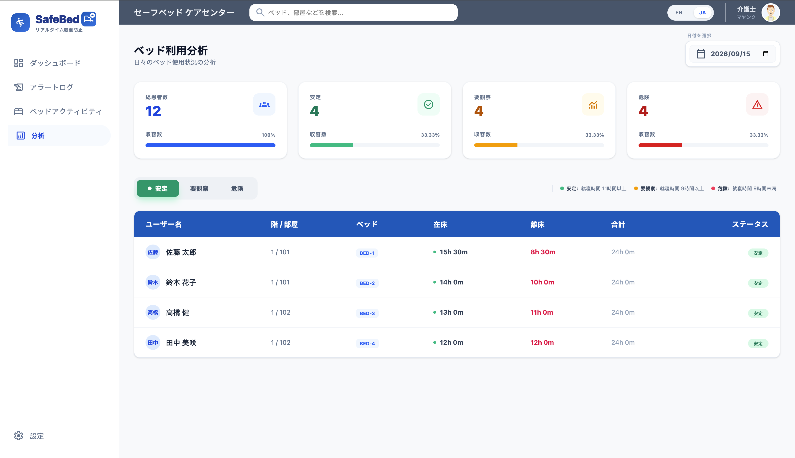
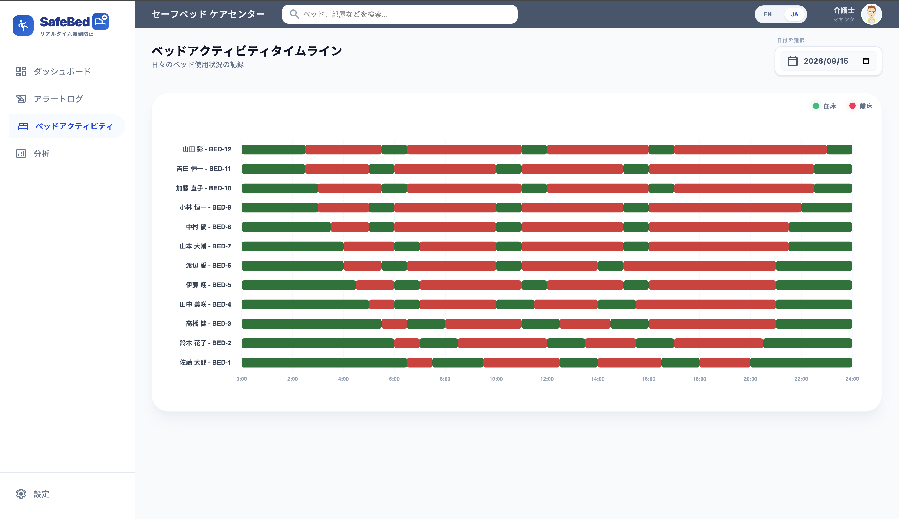
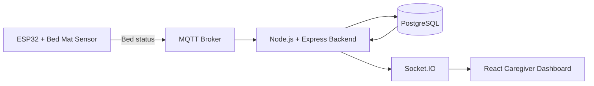
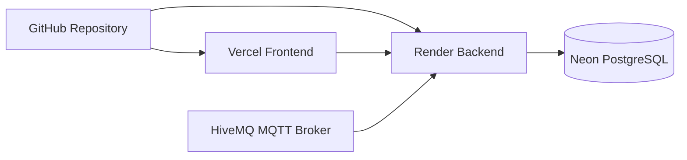

# 🛏️ SafeBed

[](https://github.com/MayankSharma2003/safebed/actions/workflows/ci.yml)

**Real-Time Fall Prevention Monitoring Platform**

SafeBed is an IoT-based monitoring platform designed to help caregivers track bed occupancy, detect bed-exit events, review historical activity, and analyze patient bed-usage patterns in real time.

> SafeBed is a portfolio/demo project and is not intended for production clinical use.

## 🌐 Live Demo

**Application:** [Open SafeBed](https://safebed.vercel.app/)

The demo uses a deterministic dataset for **September 15, 2026**, so the activity timeline and analytics remain consistent during demonstrations.

---

## 📸 Preview

### Bed Time Analytics



### Bed Activity Timeline



---

## ✨ Features

- Real-time bed occupancy monitoring
- MQTT-based IoT sensor event ingestion
- Socket.IO live browser updates
- Patient bed-activity timeline
- Bed-exit alert history
- Daily bed-usage analytics
- Good / Moderate / Poor activity classification
- English and Japanese interface
- PostgreSQL-backed historical data
- Docker-based local development
- Automatic frontend and backend deployment from GitHub

## 📊 Analytics Classification

| Status | Daily On-Bed Time |
| --- | --- |
| 🟢 Good | 11 hours or more |
| 🟠 Moderate | 9 hours or more but less than 11 hours |
| 🔴 Poor | Less than 9 hours |

Every patient's daily analytics are calculated across a complete 24-hour period.

---

## 🏗️ Architecture



### Deployment Architecture



---

## 🛠️ Tech Stack

### Frontend

- React 19
- TypeScript
- Vite
- Tailwind CSS
- MobX
- ECharts
- Axios
- React Router
- React Intl
- Socket.IO Client

### Backend

- Node.js 20
- Express
- TypeScript
- Prisma ORM
- PostgreSQL
- Socket.IO
- MQTT
- Zod

### IoT

- ESP32
- Bed mat sensor
- MQTT messaging

### Deployment

- **Frontend:** Vercel
- **Backend:** Render
- **Database:** Neon PostgreSQL
- **MQTT Broker:** HiveMQ
- **Source Control / CI:** GitHub + GitHub Actions

---

## 🔄 Real-Time Data Flow

```text
Bed Mat Sensor
      ↓
ESP32
      ↓
MQTT Broker
      ↓
Node.js / Express Backend
      ↓
PostgreSQL
      ↓
Socket.IO
      ↓
React Caregiver Dashboard
```

When the bed mat state changes, the ESP32 publishes an MQTT message. The backend processes the event, stores the activity in PostgreSQL, and broadcasts updates to connected clients through Socket.IO.

---

## 📂 Project Structure

```text
safebed/
├── backend/
│   ├── prisma/
│   │   ├── migrations/
│   │   ├── schema.prisma
│   │   └── seed.ts
│   ├── src/
│   ├── Dockerfile
│   └── package.json
│
├── frontend/
│   ├── src/
│   ├── Dockerfile
│   ├── vercel.json
│   └── package.json
│
├── Firmware/
│   └── sketch_mar23a.ino
│
├── docs/
│   └── screenshots/
│
├── docker-compose.yml
├── .env.example
└── README.md
```

---

## 💻 Running Locally

### Prerequisites

Install:

- Docker Desktop
- Node.js 20+
- npm
- Git

### 1. Clone the repository

```bash
git clone https://github.com/MayankSharma2003/safebed.git
cd safebed
```

### 2. Create the environment file

```bash
cp .env.example .env
```

Update `.env` with your local PostgreSQL and MQTT configuration.

Never commit the real `.env` file.

### 3. Start the full stack with Docker

```bash
docker compose up --build
```

The local services are available at:

| Service | Address |
| --- | --- |
| Frontend | `http://localhost:3000` |
| Backend | `http://localhost:3001` |
| PostgreSQL | `localhost:5433` |
| Backend health | `http://localhost:3001/health` |

Stop the stack with:

```bash
docker compose down
```

---

## 🗄️ Database

SafeBed uses PostgreSQL with Prisma ORM.

Generate the Prisma client:

```bash
cd backend
npx prisma generate
```

Apply existing migrations:

```bash
npx prisma migrate deploy
```

Seed the deterministic portfolio dataset:

```bash
npx prisma db seed
```

The portfolio dataset is built around **September 15, 2026** for consistent demonstrations.

---

## 🚀 Deployment

| Component | Service |
| --- | --- |
| React frontend | Vercel |
| Node.js backend | Render |
| PostgreSQL | Neon |
| MQTT broker | HiveMQ |

The frontend and backend are connected to the `main` branch.

Changes pushed to `main` trigger the connected deployment pipelines.

---

## 🔐 Security Notes

- Secrets are supplied through environment variables.
- Real `.env` files are excluded from Git.
- Production database credentials are not stored in the repository.
- Firmware source contains placeholders instead of real Wi-Fi credentials.
- The public deployment is intended for portfolio demonstration purposes.

---

## 👨‍💻 Author

**Mayank**

Backend / Full-Stack Software Engineer

Java • Spring Boot • NodeJs • React • TypeScript • PostgreSQL • Docker • Cloud • CI/CD
